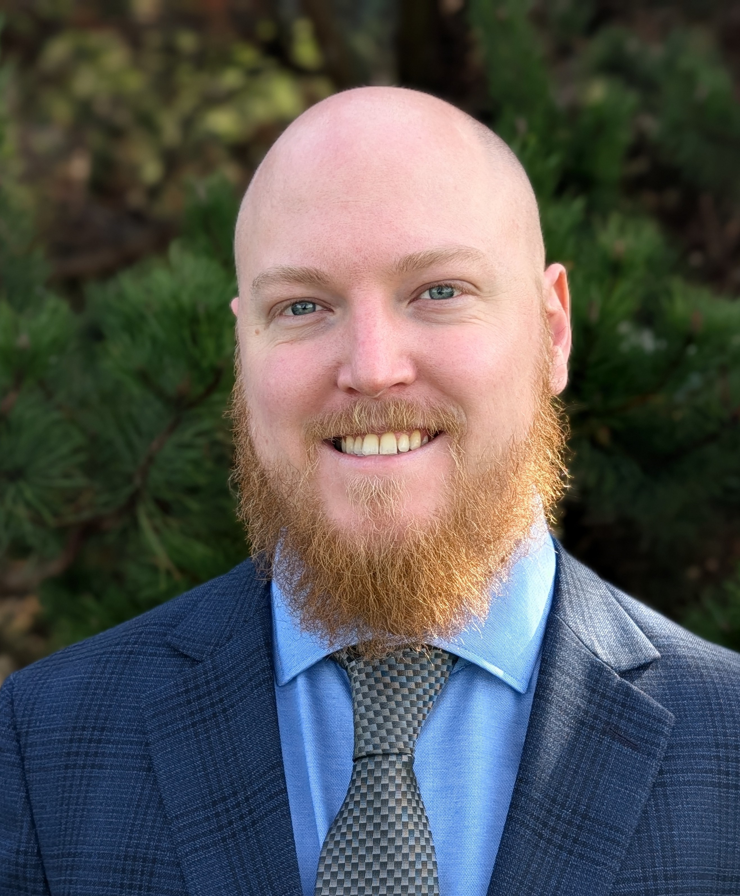

{width=200 style="border-radius: 50%; float: left; margin-right: 20px;"}

I'm a statistician based in Boston with a PhD in Statistics from Boston 
University and a background in statistical consulting. My graduate research focused on spatial modeling for satellite data. 
I'm interested in the foundations of statistical inference and what it 
actually means to draw valid conclusions from data.

I think a lot about epistemology — not in an abstract philosophical way, 
but in a practical sense: how do we know what we know, and how often 
are we fooling ourselves?

This site is where I write about statistics and whatever else I'm thinking 
about.

## Background

- PhD in Statistics, Boston University
- Experience in statistical consulting across applied domains
- Methods: Bayesian inference, regression modeling, experimental design, 
  and mixed models

## Contact

You can reach me at russjgoebel@gmail.com or find me on 
[LinkedIn](https://www.linkedin.com/in/russellgoebel/) and [GitHub](https://github.com/RussJGoebel).